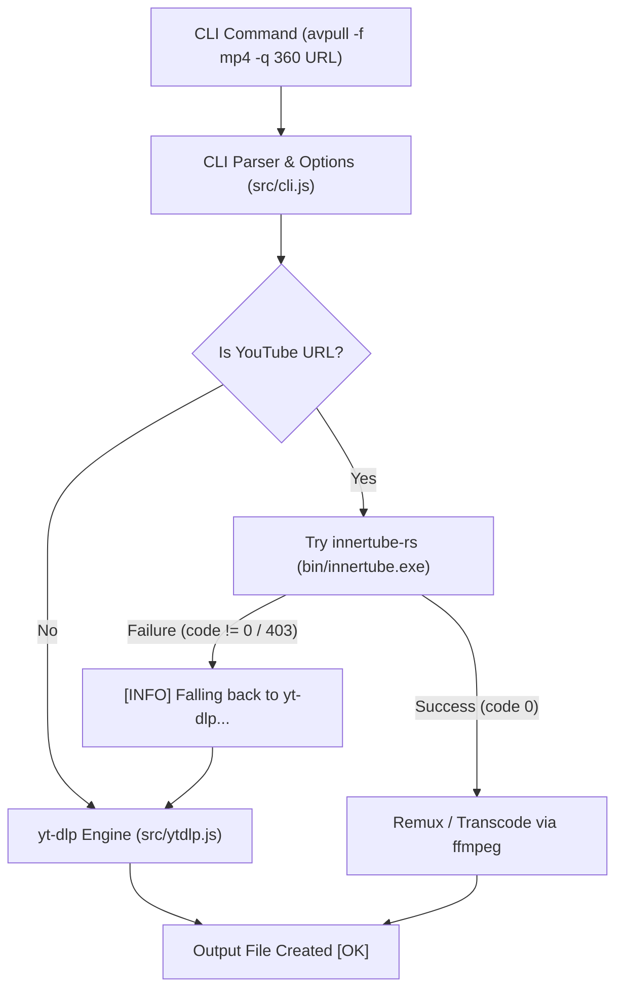

# avpull — Current Status

> **Terakhir Diperbarui**: 23 Agustus 2026  
> **Status Repositori**: `v0.1.0` (Active Development — InnerTube-rs Migration)  
> **Remote Git**: `https://github.com/caya8205-2/avpull.git` (Branch: `main`)

---

## 1. Ringkasan Proyek & Arsitektur

`avpull` adalah CLI tool Node.js untuk mengunduh dan mengonversi media audio/video dari YouTube dan platform lainnya.

### Status Migrasi Engine Backend
* **Sebelumnya**: Menggunakan library npm `youtubei.js` (JavaScript) untuk ekstraksi info & streaming download.
* **Saat Ini**: `youtubei.js` telah **dihapus sepenuhnya** dari `package.json`. Integrasi digantikan oleh:
  1. **Primary Engine**: Native binary Rust [`innertube`](file:///C:/Users/Caya/Desktop/Project/innertube-rs) (`bin/innertube.exe`) via child process IPC (JSON stdout/stderr events).
  2. **Fallback Engine**: `yt-dlp` (via `src/ytdlp.js`) otomatis aktif jika primary engine mengembalikan error / non-zero exit code.

---

## 2. Alur Eksekusi (Workflow Integration)



---

## 3. Investigasi Isu & Root Cause: 403 Forbidden pada `innertube-rs` vs `yt-dlp`

### Pertanyaan Kunci: Kenapa `yt-dlp` di avpull berhasil, sedangkan `innertube download` gagal 403?

| Aspek | `innertube download` (Rust) | `yt-dlp` Fallback |
|---|---|---|
| **Format Selection** | Memisahkan download menjadi **2 stream terpisah**: Video itag 134/137 + Audio itag 140/139 | Memilih **progressive single-file format (itag 18 / 22)** yang sudah menggabungkan audio & video 360p/720p |
| **Client Origin** | Request stream URL berasal dari client mobile `c=ANDROID_VR` | Memilih format progressive atau format Web/Android yang kompatibel |
| **CDN Restriction** | Google Video CDN memblokir multi-chunk request / adaptive audio itag 140 dari client `ANDROID_VR` jika session tidak authenticated | Format progressive itag 18 tidak terkena restriksi multi-chunk CDN dan langsung selesai dalam satu download stream |
| **Lokasi Bug** | **Masalah di Library Porting (`innertube-rs`)**, bukan pada kode JavaScript `avpull`. | — |

---

## 4. Struktur File Utama

```
avpull/
├── .agents/
│   └── CURRENT_STATUS.md            # Status aktif & dokumentasi arsitektur project
├── bin/
│   ├── avpull.js                    # Entry point CLI executable
│   └── innertube.exe                # Native compiled binary dari innertube-rs
├── src/
│   ├── cli.js                       # CLI option handling & YouTube process dispatcher
│   ├── lib.js                       # Core functions: muxVideoToFile, convertAudioToFile, ffmpeg runner
│   ├── ytdlp.js                     # Fallback downloader via yt-dlp
│   ├── platform.js                  # URL detector & parser
│   └── ui.js                        # CLI spinners, loggers, color formatting
└── package.json                     # Dependencies (tanpa youtubei.js)
```

---

## 5. Status Fungsionalitas Saat Ini

1. **Info & Metadata Extraction**: 🟢 **100% Berfungsi** via `innertube info <url>` (menghasilkan title, author, duration, format list).
2. **Fallback Mechanism**: 🟢 **100% Berfungsi** — ketika `innertube` gagal 403, avpull dengan mulus beralih ke `yt-dlp` dan menyelesaikan unduhan sampai status `[OK]`.
3. **Native Stream Download**: 🟡 **Perlu Penyempurnaan di `innertube-rs`**:
   - Format progressive (itag 18 / 22) harus diprioritaskan saat unduhan single-file / target 360p/720p.
   - Format Web deciphered atau client context yang sesuai harus digunakan untuk audio adaptive (itag 140) agar tidak ditolak CDN Google Video.

---

## 6. Action Items & Roadmap

1. **Di `innertube-rs`**:
   - Prioritaskan format progressive (itag 18/22) pada perintah `download` jika resolusi cocok atau jika format adaptive dibatasi.
   - Perbaiki integrasi download stream adaptive agar menggunakan session cookies/headers yang sesuai atau format Web deciphered.
   - Rebuild dan copy binary `innertube.exe` ke `avpull/bin/`.
2. **Di `avpull`**:
   - Mempertahankan `ytdlp.js` sebagai safety net fallback.
   - Menghapus file temporary / scratch logs setelah pengujian selesai.
